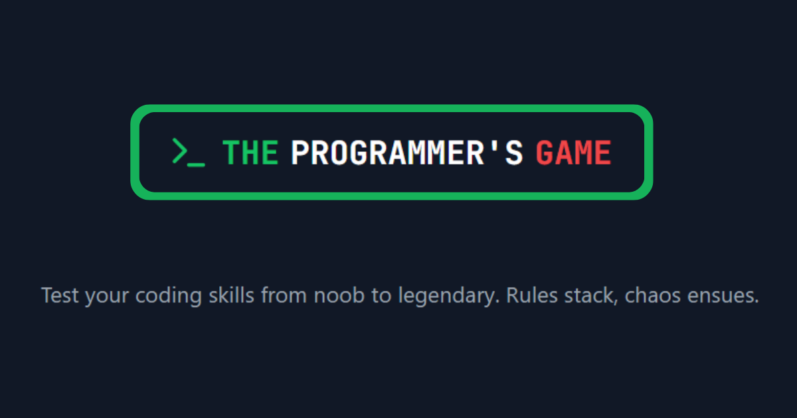

# The Programmer's Game

A chaotic programming puzzle game inspired by [The Password Game](https://neal.fun/password-game/). Stack logic, code challenges, and cyber attacks as you survive 11 escalating levels. Fail once—reset all! Can you reach the end?



## 🚀 Overview

**The Programmer's Game** is a browser-based code puzzle challenge where each level introduces a new rule or twist. Your goal: solve the puzzle, adapt to new constraints, and survive increasingly wild programming scenarios. From recursion traps and regex nightmares to simulated cyber attacks — only true code wizards reach the end.

## ✨ Features

- **11 Levels:** Each adds a new rule, from simple logic to mind-bending chaos.
- **Stacking Constraints:** All previous rules remain active. Adapt or perish!
- **Real-Time Feedback:** Immediate validation and guidance as you play.
- **Beautiful UI:** Modern, production-quality design using React, Tailwind CSS, and Lucide icons.
- **Shareable:** Challenge friends and show off your high scores.

## 🖥️ Tech Stack

- [React](https://react.dev/) + [Vite](https://vitejs.dev/)
- [TypeScript](https://www.typescriptlang.org/)
- [Tailwind CSS](https://tailwindcss.com/)
- [Lucide React](https://lucide.dev/) (icons)
- [JetBrains Mono](https://fonts.google.com/specimen/JetBrains+Mono) & [Orbitron](https://fonts.google.com/specimen/Orbitron) fonts

## 🌐 Live Demo

Try it now: [the-programmers-game.vercel.app](https://the-programmers-game.vercel.app)

## 🖼️ Screenshots

**Terminal Output View**  
<a href="https://ibb.co/TqBYLFJz"></a>  
_Shows the in-game terminal where code output and system feedback are displayed during gameplay._

**Code Editor and Input Panel**  
<a href="https://ibb.co/wZD6wmsv"></a>  
_Displays the code editor and input panel interface where users write and test their solutions._

**Instructions Panel**  
<a href="https://ibb.co/7NWhNfXc"></a>  
_Presents the step-by-step instructions or rules for the current level/challenge._

**Gameplay - Level with Multiple Rules**  
<a href="https://ibb.co/PzC80fyj"></a>  
_An in-game screenshot showing the main gameplay area with stacked rules and coding constraints visible._

**Gameplay - Challenge Progression**  
<a href="https://ibb.co/xtNQGYxy"></a>  
_Shows a different stage of gameplay, highlighting progression through challenges and interface elements._

## 🛠️ Local Development

```bash
# 1. Install dependencies
npm install

# 2. Start the development server
npm run dev

# 3. Open in your browser
http://localhost:5173
```

## 📁 Project Structure

```
.
├── public/             # Static assets
├── src/                # Source code
│   ├── components/     # Reusable React components
│   ├── data/           # Game data, rules, questions, etc.
│   ├── hooks/          # Custom React hooks
│   ├── types/          # TypeScript types
│   └── utils/          # Utility functions
├── index.html          # HTML entrypoint
├── tailwind.config.js  # Tailwind CSS config
└── README.md           # You are here!
```

## 🧩 Gameplay

- **Solve puzzles:** Each level presents a new programming challenge or constraint.
- **Stacking rules:** All previous rules remain in effect. Survive or reset!
- **Instant feedback:** See if your code/answer passes all rules.
- **Endgame:** Only the most adaptable programmers make it to Level 11.

## 🤓 Contributing

1. Fork this repo
2. Create your feature branch: `git checkout -b feat/my-feature`
3. Commit your changes: `git commit -m "Add cool feature"`
4. Push to the branch: `git push origin feat/my-feature`
5. Open a pull request!

All PRs should follow the code style (ESLint, Prettier) and pass CI checks.

## 📝 License

This project is licensed under the [MIT License](LICENSE).

---

> _Can you beat The Programmer's Game? May your recursion terminate and your regexes never backtrack!_
